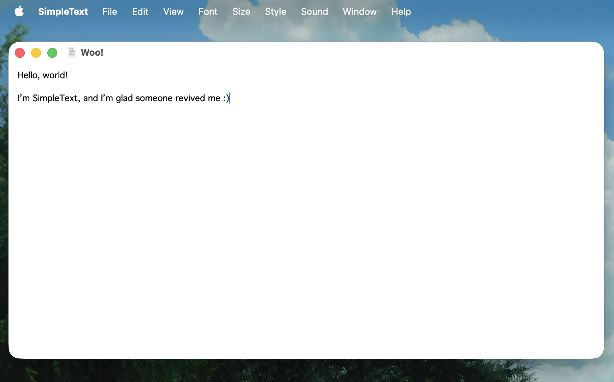
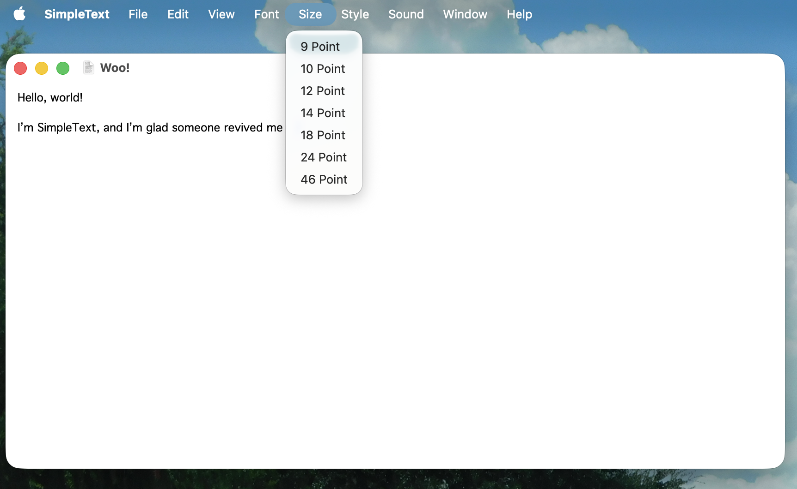
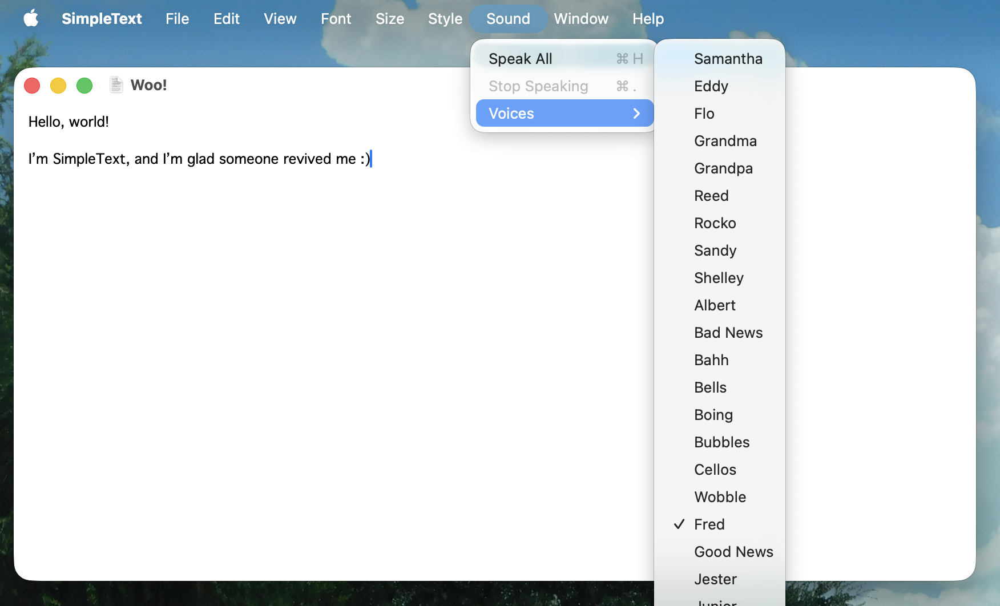

# SimpleText is reborn!
Guess what? The awesome retro SimpleText is back on the Macintosh!

I whipped this app up entirely in SwiftUI and Swift as a fun weekend project, and it turned out to be a total blast. Want Fred to read your document out loud again with a bunch of other cool retro voices? Or maybe you’d just like to chill with your favorite (limited) selection of fonts?

I hope this brings back some awesome retro vibes with your favorite text editor!

> **Feel free to tweak this as I’ve licensed it with MIT**
> 
> *Heck, even open a pull request to contribute!*

# Screenshots

